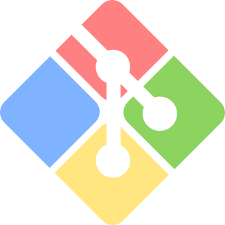
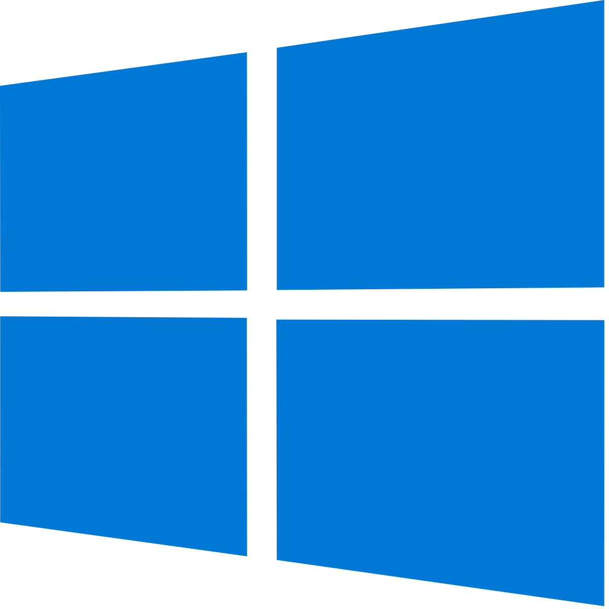

## &lt;p&gt;Hello, world!&lt;/p&gt; É um prazer receber você por aqui! 😄

Eu sou **Guilherme**, um constante estudante de **tecnologia da informação**. 📚 
Atualmente, meus **estudos** têm ênfase na área de **desenvolvimento web** fullstack. 🖥 
Tenho aprimorado diariamente os meus **conhecimentos** em HTML, CSS, JavaScript, PHP, MySQL, GIT, POO e MVC. 💻  
Quer **entrar em contato** comigo? [Clique aqui](https://guilhermecastelo.github.io/)

### Informações do GitHub:

  

### Linguagens, softwares, ferramentas e tecnologias que utilizo:

  &nbsp;&nbsp;&nbsp;&nbsp;
  &nbsp;&nbsp;&nbsp;&nbsp;
  &nbsp;&nbsp;&nbsp;&nbsp;
  &nbsp;&nbsp;&nbsp;&nbsp;
  &nbsp;&nbsp;&nbsp;&nbsp;
  &nbsp;&nbsp;&nbsp;&nbsp;
  &nbsp;&nbsp;&nbsp;&nbsp;
  &nbsp;&nbsp;&nbsp;&nbsp;
  &nbsp;&nbsp;&nbsp;&nbsp;
  &nbsp;&nbsp;&nbsp;&nbsp;

